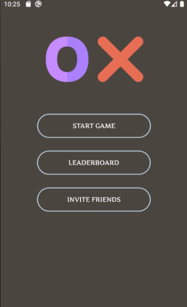
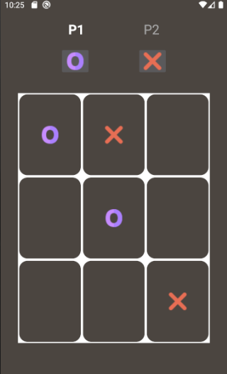
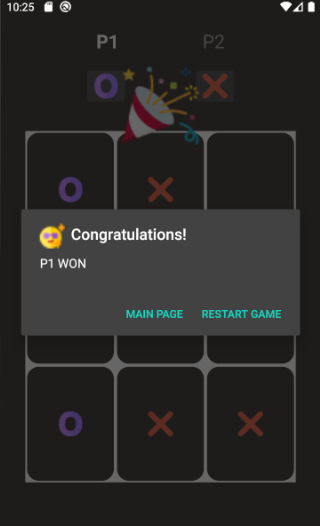

# TicTacToe

TicTacToe is a game for two players, X and O, who take turns marking the spaces in a 3×3 grid.
This is an android application which is build using kotlin. The player who succeeds in placing three of their marks in a diagonal, horizontal, or vertical row is the winner.

This is an android application which is built using kotlin.

## Main Screen

## Game Screen

## Winning Screen

# Features
- [x] Multiplayer Game
- [x] Animations shown on winning
- [x] Leaderboard to view top scores
- [x] Option to add player names
- [x] Option to restart game on winning/draw
- [x] Option to invite others by sending message
- [x] Single player game 

